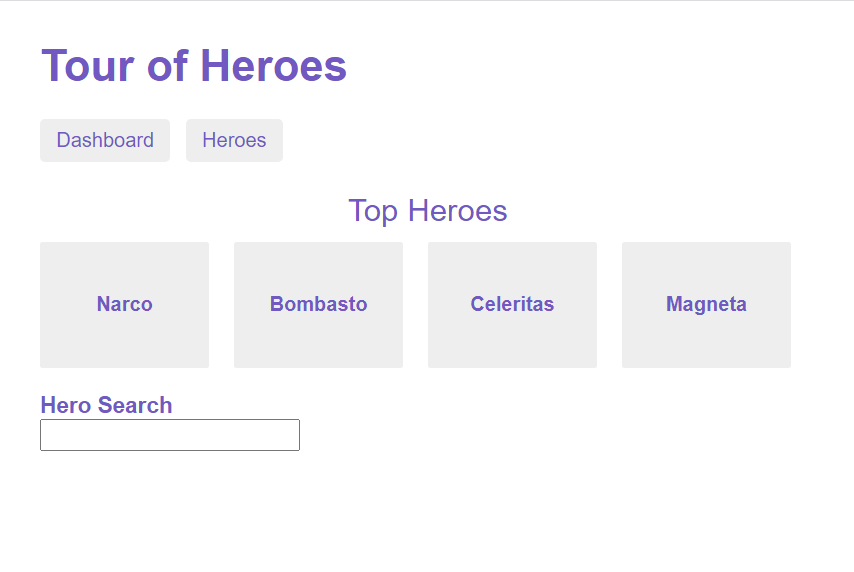
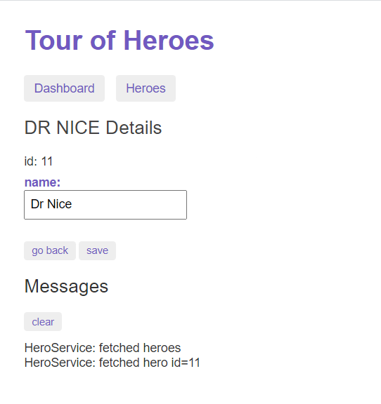
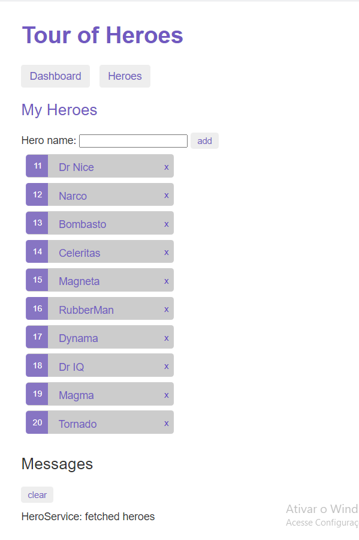

# AngularTourOfHeroes

This project was generated with [Angular CLI](https://github.com/angular/angular-cli) version 10.0.5.

# Descrição do Projeto:
Aplicação web em Angular, tutorial da própria documentação para destrinchar a mesma de forma mais dinâmica :)

## Demonstrando aplicação:
<li>
    Na primeira tela encontramos o dashboard da aplicação, listando os 4 primeiros heróis, a aplicação é muito interativa, clicando nesses containers você consegue visualizar os detalhes do campeão selecionado, logo abaixo temos um campo de busca, onde pode ser encontrado o herói desejado pesquisando pelo seu nome.
</li>
 

    

 
 
<li>
    O usuário consegue visualizar os detalhes de cada herói selecionado, podendo ver seu id, trocar seu nome ou voltar para a tela principal.
</li>
 

    

 
<li>
    Aqui temos uma lista com todos os heróis que você possui, podendo ser adicionado ou excluido um novo campeão a qualquer momento, ao selecionar o herói que deseja você vai para os detalhes do herói como mostrado acima.
</li>
 

    

## Development server

Run `ng serve` for a dev server. Navigate to `http://localhost:4200/`. The app will automatically reload if you change any of the source files.

## Code scaffolding

Run `ng generate component component-name` to generate a new component. You can also use `ng generate directive|pipe|service|class|guard|interface|enum|module`.

## Build

Run `ng build` to build the project. The build artifacts will be stored in the `dist/` directory. Use the `--prod` flag for a production build.

## Running unit tests

Run `ng test` to execute the unit tests via [Karma](https://karma-runner.github.io).

## Running end-to-end tests

Run `ng e2e` to execute the end-to-end tests via [Protractor](http://www.protractortest.org/).

## Further help

To get more help on the Angular CLI use `ng help` or go check out the [Angular CLI README](https://github.com/angular/angular-cli/blob/master/README.md).
